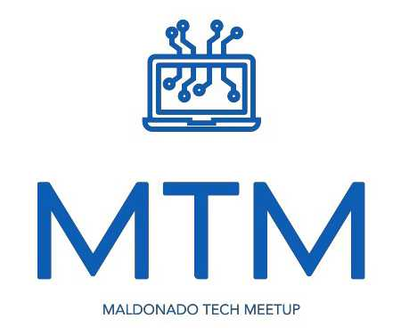
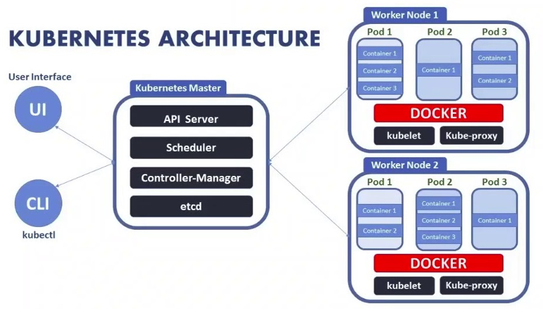

# Taller KUBERNETES MTM 🔨🐳🚀 

# ¿Que es esto? :eyes:

* Taller de introduccion a Kubernetes con un ambiente interactivo

*  Material necesario para hacer taller de **Kubernetes**
   * Laptop/pc
   * Internet
+ Modulos para seguir el taller **K8S**
  + [Modulo 1](https://www.katacoda.com/santicomp2/scenarios/1) - Crear un cluster de Kubernetes ⚓
  + [Modulo 2](https://www.katacoda.com/santicomp2/scenarios/7) - Deploy de una app 🐳
  + [Modulo 3](https://www.katacoda.com/santicomp2/scenarios/4) - Explorar la app 👀
  + [Modulo 4](https://www.katacoda.com/santicomp2/scenarios/8) - Exponer la app públicamente 🌍
  + [Modulo 5](https://www.katacoda.com/santicomp2/scenarios/5) - Escalar la app 🚀
  + [Modulo 6](https://www.katacoda.com/santicomp2/scenarios/6) - Actualizar la app 🔨

# ¿Para que sirve? :satisfied:
[Kubernetes](https://kubernetes.io/es/) es un orchestador de contendores liberado por Google luego de su experiencia con un proyecto interno llamado Borg.
Kubernetes se volvio masivamente popular versus sus competidores (Docker Swarm/Mesosphere etc).

Se estandarizo su uso en las companias para poder hacer arquitecturas de microservicios y otras arquitecturas que antes eran prohibitivas por costo o complejidad de operacion.

# Material/Recursos Adicionales  📚
* [Videos Epañol](https://www.youtube.com/watch?v=tNHD8LO2cwM)
* [Videos de K8S Updates](https://www.youtube.com/channel/UCjQU5ZI2mHswy7OOsii_URg)
* [Podcast/Info en Software Engineering Daily](https://softwareengineeringdaily.com/?s=kubernetes)
* [Medium](https://medium.com/@marvin.soto/k8s-t%C3%A9cnicamente-explicados-da9b2748bcca)
* [Blogs K8S](https://learnk8s.io/blog/)

# Objectivos del taller :dart:
* [x]  Mostrar conceptos basicos Kubernetes
* [x]  Divertirse en MTM
* [x]  Seguir modulos de ejemplo

# Cosas para investigar en casa 🔍
* [x]  Minikube local en docker
* [x]  Minikube en VM (VMWare)
* [x]  [Docker from Zero to Hero](https://es.slideshare.net/fazalraja/docker-from-zero-to-hero-81492331)
* [x]  [GCE Google Container Engine](https://cloud.google.com/kubernetes-engine/?hl=es)
* [x]  [AKS Amazon Managed Kubernetes](https://aws.amazon.com/es/eks/)
* [x]  [Istio](https://istio.io/)
* [x]  [Linkerd](https://linkerd.io/)
* [x]  [KNative](https://cloud.google.com/knative/)
* [x]  [Amazon EKS Workshopa](https://eksworkshop.com/)
* [x]  [Digital Ocean Kubernetes](https://www.digitalocean.com/resources/kubernetes/)
* [x]  [Mesosphere K8S Engine](https://mesosphere.com/product/kubernetes-engine/)
* [x]  [OpenWhisk Serverless](https://openwhisk.apache.org/)
* [x]  [Crossplane K8S Extendido ⚗](https://crossplane.io/)

# Kubernetes VS Serverless

Kubernetes esta siendo operado por la **mayoria de los provedores cloud** y tambien puede ser instalado **on premise** manualmente, o con ayuda de alguna tecnologia ejemplo [Mesosphere](https://mesosphere.com/product/kubernetes-engine/).

+ Evita el vendor [lockin](https://techbeacon.com/enterprise-it/serverless-vendor-lock-should-you-be-worried) 🔑 en otras palabras estar atado a un provedor ejemplo AWS, si quiero cambiar porque subio el precio puedo iniciar mis pods en otro cluster y funciona igual.
Igual esto no es un problema tan grave, porque siempre estamos atado por el stack/cloud etc no es tan facil migrar esto.

+ Evita los [cold starts](https://mikhail.io/serverless/coldstarts/aws/) ❄ esto pasa cuando ejemplo Aws Lambda un otro tiene que iniciar la funcion y aun no esta listo para ejecutar, dependiendo del tamaño y si este usa algun recurso de red puede demorar de unos milisegundos hasta varios segundos en el caso de VPC en Amazon. Esto sucede no solo al principio sino que cada x cantidad de peticiones, hay maneras de reducir esto pero no es tan sencillo depende del cloud provider.

+ Kubernetes se utliza como un pilar para otras tecnologias ejemplo [OpenWhisk](https://openwhisk.apache.org/) el cual permite ejecutar funciones olvidadose de la infraestructura tal como Serverless de otros provedores.

+ Se puede usar tambien [KNative](https://cloud.google.com/knative/) que es una iniciativa parecida a la anterior, intenta reducir la complejidad de K8S y permite levantar aplicacion sin tener que saber tanto sobre Kubernetes, Se puede escalar la aplicacion con la cantidad de trafico ejemplo hay 10 user hay 2 pods, si sube la cantidad se inician solo los pods.

+ Se pueden utilizar arquitecturas Service Mesh ejemplo [Istio](https://istio.io/)/[Linkerd](https://linkerd.io/) esto sirve para usar cualquier tipo de app Java/C# etc con una manera estandar de monitorear controlar trafico etc.

# Docker Original :whale:

Katacoda original en ingles
Upstream https://github.com/katacoda-scenarios/kubernetes-bootcamp-scenarios
Modificado para caso de uso MTM en español :rocket:
